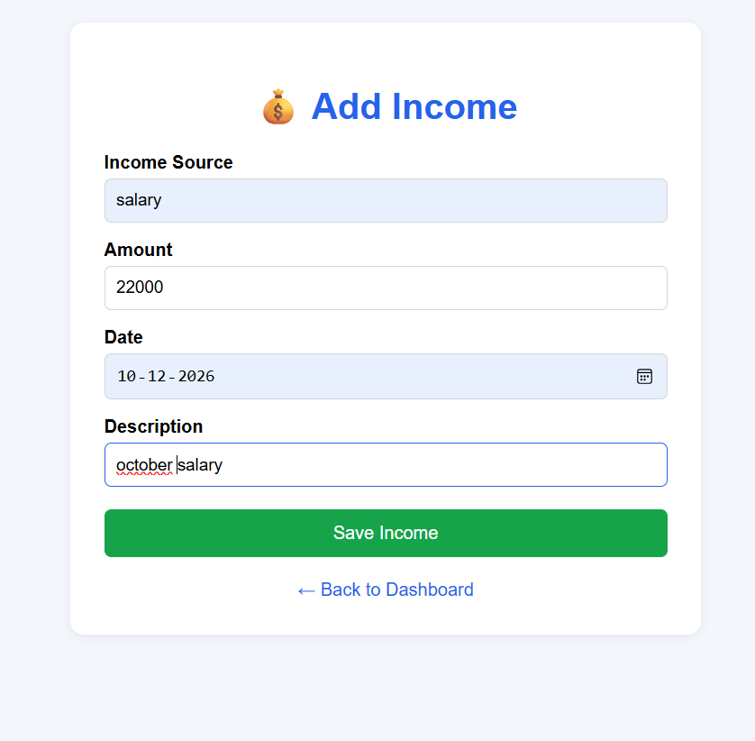

# 💰 MoneyMate - Personal Finance Manager

MoneyMate is a web-based Personal Finance Manager built using Python Flask and MySQL.

It helps users manage their income and expenses, track monthly spending, set budgets, and visualize expense categories through an interactive dashboard.

---

## 🚀 Features

- 🔐 User registration and login
- 🔒 Secure password hashing
- 💵 Add, edit, and delete income
- 💸 Add, edit, and delete expenses
- 🔎 Search and filter transactions
- 📊 Expense analytics
- 🥧 Interactive expense pie chart
- 🎯 Monthly budget management
- 📈 Budget usage percentage
- ⚠️ Budget warning and over-budget alerts
- 👤 User-specific financial data
- 🗄️ MySQL database integration
- 📱 Responsive dashboard

---

## 🖥️ Application Screenshots

### 📊 Dashboard


### 💵 Add Income


### 💸 Add Expense



---

## 🛠️ Technologies Used

### Backend

- Python
- Flask
- Werkzeug
- MySQL Connector/Python

### Frontend

- HTML
- CSS
- JavaScript
- Chart.js

### Database

- MySQL 8.0

### Tools

- Visual Studio Code
- Git
- GitHub
- Python Virtual Environment

---

## 📂 Project Structure

```text
MoneyMate/
│
├── app.py
├── db.py
├── test_db.py
├── .gitignore
├── README.md
├── dashboard.png
├── income.png
├── expense.png
│
├── templates/
│   ├── dashboard.html
│   ├── login.html
│   ├── register.html
│   ├── add_income.html
│   ├── edit_income.html
│   ├── add_expense.html
│   ├── edit_expense.html
│   └── budget.html
│
└── venv/